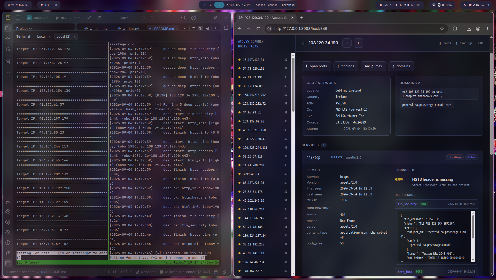
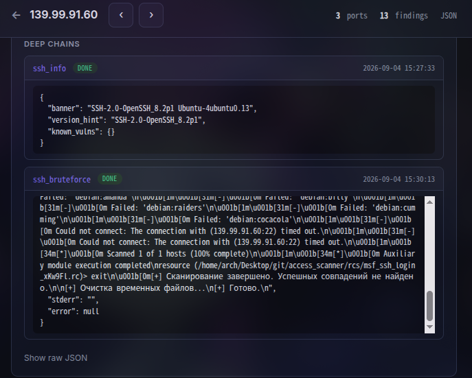

# Access Scanner



Активный сетевой сканер и разведчик хостов: primary-скан портов → deep-цепочки → risk score → веб-UI.

Проект читает очередь IP с открытыми портами, для каждого хоста собирает observations/findings, запускает углублённые цепочки (HTTP/HTML/SSH/RDP/…), считает риск и отдаёт результат в SQLite и во Flask-интерфейс.

> **Назначение.** Инструмент для аудита и разведки **своих** сетей / с явного разрешения. Не предназначен для несанкционированного сканирования.

Ставишь на фон - собираешь хосты с инфой об открытых портах

> ⚠️ **Важно:** НЕ шалите вас накажут

---

## Возможности

- **Primary scan** по известным портам: HTTP(S), SSH, RDP, SMB, FTP, SMTP, DNS, Telnet, VNC, POP3 и др.
- **Deep chains** после primary: заголовки, dirbust (ffuf), HTML-анализ (API/XSS/CSRF/секреты), TLS, SSH-info, заготовки brute и т.д.
- **Intelligence:** reverse DNS, geo, TLS-сертификат (CN/SAN).
- **Risk engine:** агрегированный score хоста по findings.
- **Очередь deep-задач** с приоритетами, лимитом параллельных bash-процессов и timeout.
- **Web UI** + JSON API: список хостов, карточка хоста, очередь deep-tasks.

---

## Архитектура

```
genip.sh  ──►  active_hosts.txt  ──►  worker.py
                                        │
                                        ├─ scanners/*     (primary)
                                        ├─ intelligence/* (geo, dns, tls)
                                        ├─ chains/*       (deep)
                                        ├─ database.py    (SQLite)
                                        └─ risk_engine.py
                                              │
                                         data/recon.db
                                              │
                                         webapp.py (Flask UI)
```

| Компонент | Роль |
|-----------|------|
| `genip.sh` | Discovery: пишет IP и порты в `active_hosts.txt` |
| `worker.py` | Читает очередь, primary-скан, enqueue deep, risk |
| `main.py` | Диспетчер модулей сканеров по порту |
| `scanners/` | Primary-модули (`run(ip, port, proto) → dict`) |
| `chains/` | Deep-цепочки после primary |
| `chains/registry.py` | Сервис → список цепочек, handlers |
| `deep_runner.py` | Thread pool + лимит bash + timeout/kill |
| `database.py` | Схема SQLite, enqueue/save deep |
| `models.py` | `HostProfile` — снимок хоста для UI/API |
| `risk_engine.py` | Score и уровень риска |
| `webapp.py` | Flask: `/`, `/host/<id>`, `/tasks`, `/api/*` |

---

## Быстрый старт

### Зависимости

```bash
python3 -m venv .venv
source .venv/bin/activate
pip install flask requests beautifulsoup4
# опционально для dirbust:
# ffuf  (в PATH)
```

Системные утилиты по мере использования цепочек: `ffuf`, при необходимости `hydra`/`nmap` и т.п.

### Инициализация БД

```bash
python3 database.py
# или просто первый запуск worker / webapp — init_db вызывается сам
```

### Запуск пайплайна

```bash
chmod +x runner.sh genip.sh run_web.sh reset_db.sh
./runner.sh          # discovery + worker в фоне, логи в tmux
# в другом терминале:
./run_web.sh         # Flask UI, обычно http://127.0.0.1:5000
```

Либо вручную:

```bash
mkdir -p state logs data
# положить цели в active_hosts.txt, формат:
# 203.0.113.10 22/tcp 80/tcp 443/tcp
python3 worker.py
python3 webapp.py
```

### Сброс состояния

```bash
./reset_db.sh        # осторожно: чистит state/, data/, logs/
```

---

## Формат очереди

Файл `active_hosts.txt` (append-only), worker хранит offset в `state/worker.offset`:

```
203.0.113.10 22/tcp 80/tcp 443/tcp
198.51.100.5 445/tcp 3389/tcp
```

Одна строка = один IP + список `port/proto`.

---

## Primary scanners

Модуль выбирается в `main.load_module`:

1. Порт из `HTTP_PORTS` → `scanners.http`
2. Порт из `HTTPS_PORTS` → `scanners.https`
3. Иначе `scanners.port_<port>` (если есть)

**HTTP_PORTS:** 80, 3000, 5000, 8000, 8008, 8080, 8081, 8088, 8888, 9000  
**HTTPS_PORTS:** 443, 4443, 8443, 9443  

Есть модули: `port_21`, `22`, `23`, `25`, `53`, `80`, `110`, `443`, `445`, `3389`, `5900`, плюс общие `http.py` / `https.py`.

Контракт модуля:

```python
def run(ip, port, proto) -> dict:
    # через scanners.common.result / finding
    return {
        "service": "http",
        "port": port,
        "protocol": proto,
        "observations": {...},
        "findings": [...],
    }
```

После primary worker:

- пишет observation / findings / domains (PTR, cert) / geo;
- для сервиса ставит в очередь deep-цепочки из `SERVICE_CHAINS`;
- пересчитывает risk score.

---

## Deep chains

Реестр: `chains/registry.py`.

| Сервис | Цепочки |
|--------|---------|
| `http` | `http_info`, `http_headers`, `html_info`, `http_dirs` |
| `https` | `tls_security`, `http_info`, `http_headers`, `html_info`, `https_dirs` |
| `ssh` | `ssh_info`, `ssh_bruteforce` (заготовка) |
| `rdp` | `rdp_info` |
| `ftp` / `smtp` / `smb` / `vnc` / `telnet` / `dns` / `pop3` | `*_info` stubs |



Тяжёлые цепочки (`HEAVY_CHAINS` в `deep_runner.py`: dirbust, brute и т.п.) идут с меньшим priority и через общий bash-семафор.

### HTML chain (`html_info`)

Срабатывает **только если** в primary observations:

- `content_type` содержит `html` / `xhtml`;
- `body_size > MIN_HTML_SIZE` (по умолчанию **512** байт).

Иначе возвращает `{ "ok": false, "skipped": true, "reason": "..." }`.

При успехе повторно качает страницу и ищет:

- интересные URL (`/api`, `/graphql`, `/swagger`, `/admin`, `/.git`, `/.env`, …);
- редиректы (meta refresh, JS `location`, form → API/auth);
- XSS-кандидаты (`innerHTML`, `eval`, `document.write`, …);
- CSRF: POST-формы без очевидного CSRF-токена;
- утечки секретов (JWT, Bearer, api_key, AWS keys, private key blocks — значения маскируются).

Код: `chains/html/_html.py`, точка входа `run(ctx)`.

### HTTP dirs

`chains/http/search_dirs.sh` + ffuf через `deep_runner.run_bash`.  
Для HTTPS — `search_dirs_by_domain` по известным доменам (лимит доменов на задачу).

---

## База данных

SQLite: `data/recon.db`.

Основные таблицы:

- `hosts` — IP, first/last seen, `risk_score`
- `scans` — прогоны
- `service_observations` — порт/сервис + `raw_json`
- `findings` — findings primary/deep
- `domains`, `geo`
- `deep_tasks` — очередь цепочек (`pending` / `running` / `done`)
- `deep_results` — key/value по задаче

Снимок для UI: `models.HostProfile` / `get_host_by_ip` / `get_host_by_id`.

---

## Web UI

```bash
./run_web.sh
# или: python3 webapp.py
```

| URL | Описание |
|-----|----------|
| `/` | Список хостов, risk |
| `/host/<id>` | Карточка: сервисы, findings, deep |
| `/tasks` | Очередь deep-tasks |
| `/api/hosts` | JSON список |
| `/api/host/<id>` | JSON профиль |
| `/api/tasks` | JSON очередь |
| `/health` | Healthcheck |

Шаблоны: `templates/`, стили: `static/style.css`.

---

## Конфигурация (env)

| Переменная | Default | Смысл |
|------------|---------|--------|
| `DEEP_WORKERS` | 4 | Потоки Python для deep |
| `DEEP_BASH_LIMIT` | 2 | Одновременных bash (ffuf/hydra/…) |
| `DEEP_TIMEOUT` | 300 | Timeout цепочки (сек), kill по истечении |
| `DEEP_BATCH` | 20 | Сколько pending забирать за раз |

Порог HTML: константа `MIN_HTML_SIZE` в `chains/html/_html.py`.

---

## Как добавить сканер / цепочку

**Новый primary-порт**

1. `scanners/port_<N>.py` с `run(ip, port, proto)`.
2. При необходимости добавить порт в `HTTP_PORTS` / `HTTPS_PORTS` в `main.py`.

**Новая deep-цепочка**

1. Handler `def my_chain(ctx) -> dict` в модуле `chains/...` или в `registry.py`.
2. Имя в `SERVICE_CHAINS[service]`.
3. Запись в `_HANDLERS`.
4. Если долгий bash — добавить имя в `HEAVY_CHAINS` и вызывать `deep_runner.run_bash`.

`ctx` всегда содержит: `ip`, `port`, `protocol`, `service`, `version`, `banner`, `observation_id`, `host_id`, `domains`, `geo`, `raw`.

---

## Структура каталогов

```
.
├── main.py              # диспетчер primary-модулей
├── worker.py            # очередь IP → scan → deep → risk
├── webapp.py            # Flask UI/API
├── database.py          # SQLite schema + CRUD
├── models.py            # HostProfile / Service / Finding
├── risk_engine.py
├── deep_runner.py
├── host_view.py
├── optional.py
├── genip.sh / runner.sh / run_web.sh / reset_db.sh
├── scanners/
│   ├── common.py
│   ├── http.py / https.py
│   └── port_*.py
├── chains/
│   ├── registry.py
│   ├── html/_html.py
│   ├── http/_http.py, search_dirs.sh
│   ├── ssh/, rdp/, smb/, telnet/
├── intelligence/
│   ├── dns.py / geo.py / tls_info.py
├── templates/ / static/
├── data/recon.db        # runtime
├── state/               # worker.offset
└── logs/
```

---

## Ограничения и заметки

- Primary HTTP/HTTPS читает тело до **64 KiB**; deep HTML ходит отдельным запросом.
- Dirbust и brute зависят от внешних бинарников и словарей — без них цепочки вернут error/stub.
- Часть `*_info` цепочек — заглушки (`note: … stub`).
- Риск-score эвристический, не замена полноценного vuln-assessment.
- Сканируйте только то, на что есть право.

---