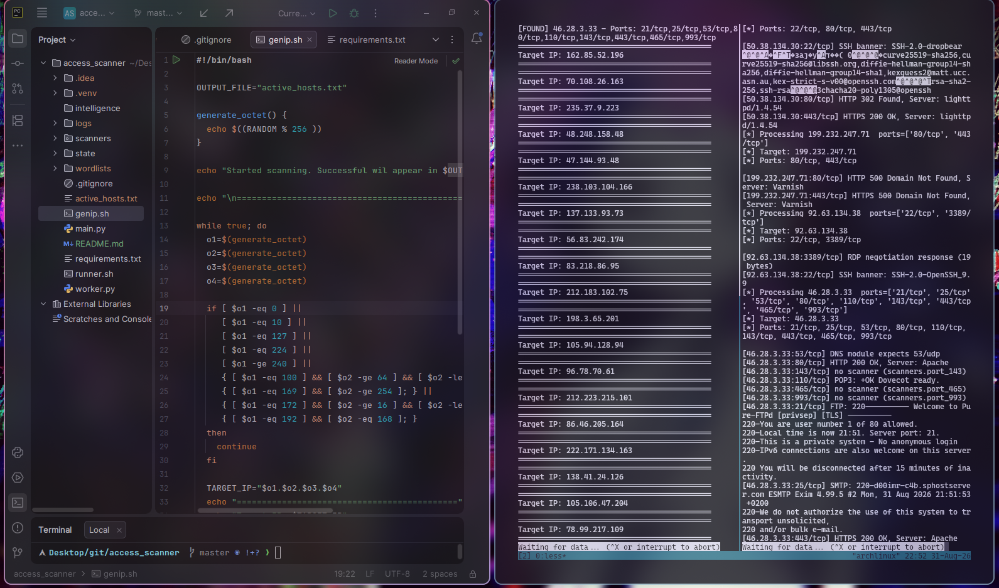

# Active Host Recon

Небольшой модульный инструмент для **активной разведки хостов**, автоматического определения доступных сервисов и сбора базовой информации о них

Ставишь на фон - собираешь хосты с инфой об открытых портах

> ⚠️ **Важно:** НЕ шалите вас накажут

---

## Возможности

* 🔎 активная разведка;
* 🌐 определение доступных TCP/UDP сервисов;
* 🧩 модульная архитектура;
* ⚙️ автоматический выбор обработчика по порту/протоколу;
* 📝 ведение журналов discovery и worker-процесса;
* ▶️ возможность непрерывной фоновой работы;

---

## Архитектура
(на данный момент)
```text
                         ┌──────────────────┐
                         │    Discovery     │
                         │                  │
                         │ random targets   │
                         │       +          │
                         │      Nmap        │
                         └────────┬─────────┘
                                  │
                                  │ active hosts
                                  ▼
                         ┌──────────────────┐
                         │ active_hosts.txt │
                         └────────┬─────────┘
                                  │
                                  │ queue
                                  ▼
                         ┌──────────────────┐
                         │      Worker      │
                         │                  │
                         │  read → parse    │
                         │  → dispatch      │
                         └────────┬─────────┘
                                  │
                    ┌─────────────┼─────────────┐
                    ▼             ▼             ▼
                 HTTP/HTTPS      SSH           SMB
                    │             │             │
                    ▼             ▼             ▼
                 modules/       modules/      modules/
                    │
                    ▼
                 Logs / Reports
```

Основная идея проекта — автоматизировать разведку до эксплуатации

В `active_hosts.txt` остаются активные хосты, так что при расширении модульной архитектуры Worker сам решит, где ещё не заworkaл

```active_hosts.txt
192.168.1.10 22/tcp 80/tcp
192.168.1.20 443/tcp
192.168.1.30 22/tcp 8080/tcp 8443/tcp
```

---

## Worker

— основной процесс обработки.


1. открывает `active_hosts.txt`
2. продолжает чтение с сохранённой позиции
3. получает IP и список открытых портов
4. передаёт каждый порт в `main.py`
5. main выбирает соответствующий модуль
6. результат записывается в журнал

Состояние чтения хранится отдельно:

```text
state/worker.offset
```

Поэтому перезапуск worker не требует повторной обработки уже пройденной части файла.

---

Для web-сервисов предусмотрена отдельная концепция группы **HTTP/HTTPS**.

Это позволяет обрабатывать не только стандартные:

```text
80/tcp
443/tcp
```

но и распространённые нестандартные web-порты:

```text
3000/tcp
5000/tcp
8000/tcp
8080/tcp
8081/tcp
8088/tcp
8443/tcp
8888/tcp
9000/tcp
9443/tcp
```

При необходимости отдельный порт может иметь собственный специализированный модуль.

---

## Модули

```python
def run(ip, port, proto):
    ...
```

Например:

```text
modules/
├── port_22.py       # SSH
├── port_21.py       # FTP
├── port_25.py       # SMTP
├── port_53.py       # DNS
├── port_80.py       # HTTP
├── port_443.py      # HTTPS
├── port_445.py      # SMB
├── port_3389.py     # RDP
└── port_5900.py     # VNC
```

Модуль должен возвращать краткий результат, который worker сможет записать в журнал.

TODO: Абстрагировать модули, добавить оценку защиты хоста и возможные эксплуатации

---

## HTTP / HTTPS

* HTTP status code;
* `Server`;
* `Location`;
* `Content-Type`;
* `Content-Length`;
* `X-Powered-By`;
* наличие authentication challenge;
* title страницы;
* redirect information;
* признаки web-приложения.

Для HTTPS дополнительно:

* TLS version;
* certificate subject;
* issuer;
* expiration;
* SAN;
* базовую информацию о TLS-соединении.

Нестандартный порт сам по себе не означает наличие HTTP, поэтому для таких портов модуль должен сначала подтвердить, что сервис действительно является HTTP/HTTPS.

---

## Логи


---

## Запуск

Основной entry point:

```bash
./runner.sh
```

После запуска:

```text
runner
 ├── discovery
 │    └── active_hosts.txt
 │
 └── worker
      └── hub
           └── modules
```


---

## Планируемые модули

Примерный roadmap:

### Network

* [x] SSH — `22/tcp`
* [x] FTP — `21/tcp`
* [x] Telnet — `23/tcp`
* [x] SMTP — `25/tcp`
* [x] DNS — `53/udp`
* [x] SMB — `445/tcp`
* [x] RDP — `3389/tcp`
* [x] VNC — `5900/tcp`

### Web

* [x] HTTP — `80/tcp`
* [x] HTTPS — `443/tcp`
* [ ] HTTP common ports
* [ ] HTTPS common ports
* [ ] redirect detection
* [ ] TLS certificate information
* [ ] HTTP technology detection
* [ ] virtual-host information

### Databases

* [ ] MySQL — `3306/tcp`
* [ ] PostgreSQL — `5432/tcp`
* [ ] Redis — `6379/tcp`
* [ ] MongoDB — `27017/tcp`
* [ ] Elasticsearch — `9200/tcp`

### Infrastructure

* [ ] Docker API — `2375/tcp`
* [ ] Docker TLS — `2376/tcp`
* [ ] Kubernetes API — `6443/tcp`
* [ ] common management interfaces
* [ ] common monitoring interfaces

---

## Roadmap

```text
[x] Discovery process
[x] active_hosts.txt
[x] Worker
[x] Module hub
[x] Basic service modules
[ ] HTTP family
[ ] HTTPS/TLS analysis
[ ] Structured JSON logs
[ ] Result database
[ ] Deduplication
[ ] Service fingerprinting
[ ] Better state management
[ ] Web UI
```

